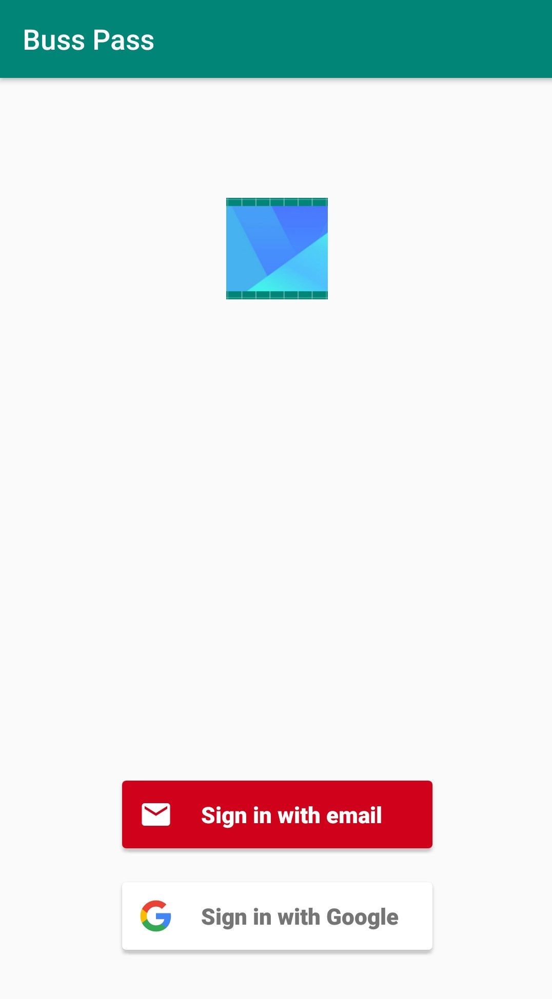
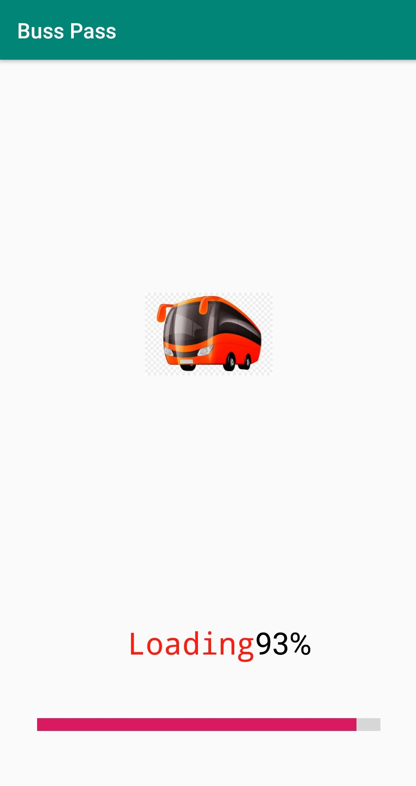
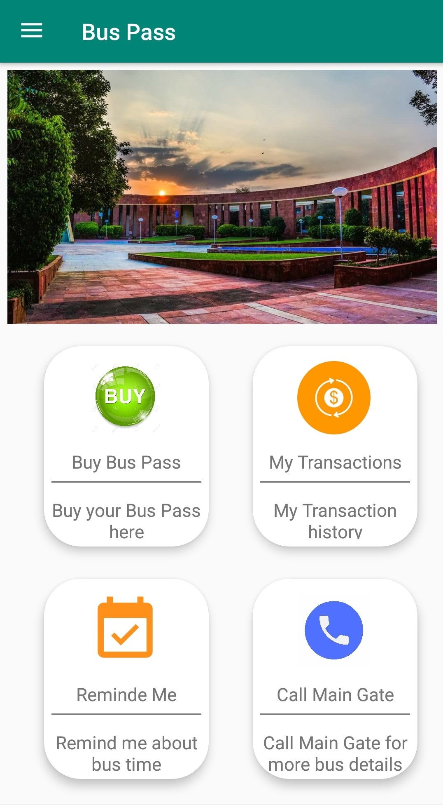
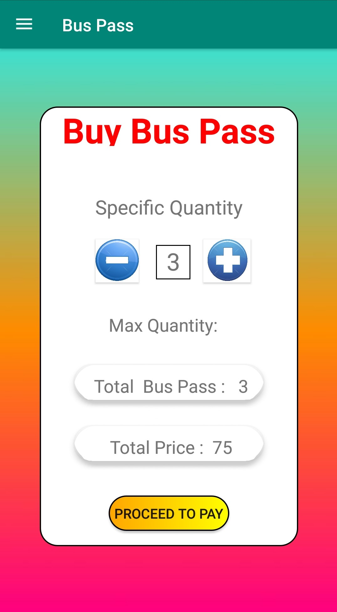
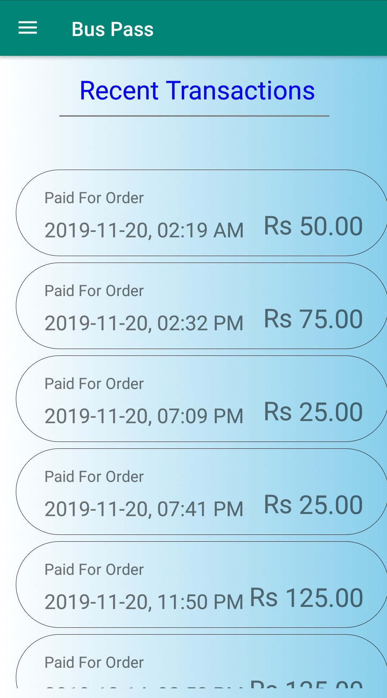
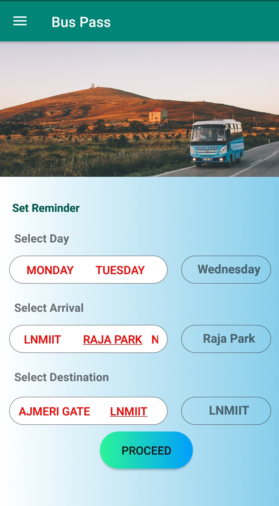
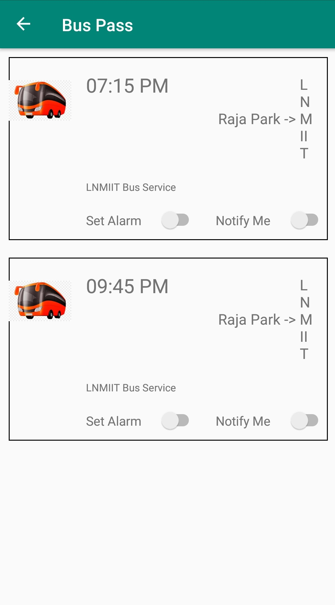

# BussPass

This application was created in an attempt to make the current Bus Pass System in our institute digital. 
It includes all forms of cashless payments like e-wallets, Net Banking, Payment via Credit/Debit Cards and much more. 
This feature was accomplished by using the Paytm Payment Gateway. 
The application includes several other features like an active alarm system, a notification system, and a reminder system. 
It makes use of Google's Firebase to store and fetch data in real-time. BussPass was created keeping in mind the college students that would be using the application. 
Hence, a lot of effort and time was invested in creating an interactive and user-friendly UI. The application contains several other features that are for you to find out. 
Download the apk file and explore!

## Features

1. **Login Activity**

  Appears whenever the user has to log in. Keeps the user logged in until they choose to log out.
  
  
  
  
2. **Load Activity**

  Always appears when the user opens the application.

  
  
  
3. **Main Activity**

  The main screen which gives the user an option to buy bus passes, see the transaction history, open the reminder system and call the bus operators for more detail.
  It also helps in trigerring the sidebar navigation drawer.
  
  
  
  
4. **Ticket Activity**
   
  User can select the number of tickets they want to purchase, since each ticket costs a default ₹25, prices are automatically updated as the user selects the number of tickets 
  they want to purchase. A minimum of 1 and a maximum of 10 tickets can be purchased.
  
  
  
  
5. **Transaction History Activity**

  The transaction data is stored on a cloud and is extracted in real time using the Firebase integration. Hence the transaction history is accurate and cannot be tampered with.
  
  
  
  
6. **Route Selection Activity**

  To proceed to the reminder system or to just check the available number of busses and their timings on a particular day, this activity can help choose the needful.
  
  
  
  
7. **Alarm and Notification Activity**

  Acts as a bus availability checker and provides features such as alarm and notification to remind users to catch their busses.
  
  
  
  
  
